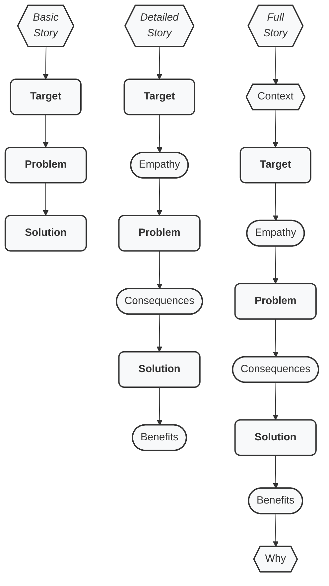
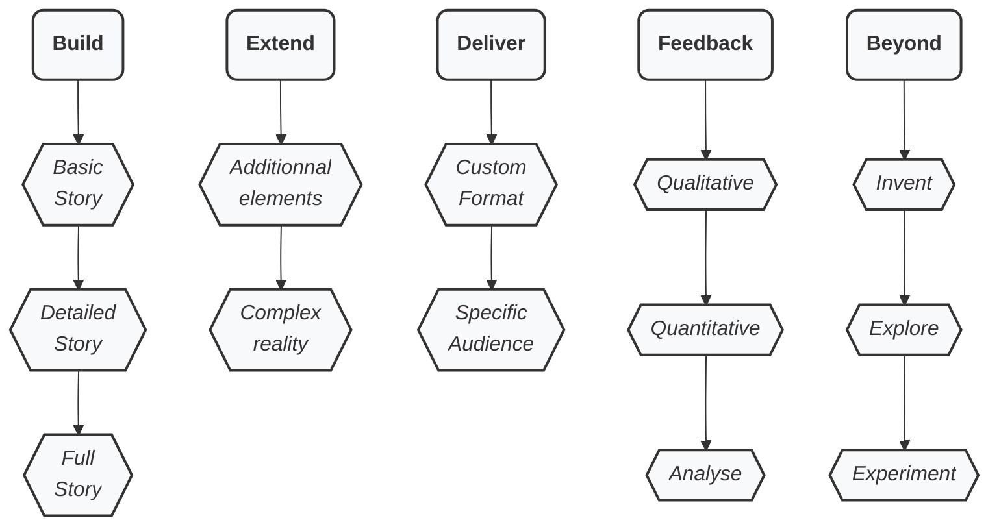

# Lean Storytelling

Have you ever tried to tell stories about products or services? It's difficult... And mayb a little frustrating.
Or maybe you have tried to listen to stories about products or services? And that was not the best time of your life...

It's not about the boredom, it may be more about the structure of the narrative arc.

With the **Lean Storytelling** methodology:
Learn to **craft and deliver** compelling, efficient, and convincing **stories**, about your business, service, or product!

How **Lean Storytelling** works for you:

- **Shape and structure** your story, with the foundational building blocks, to **setup the core**.
- **Extend and complete** your narrative, with additional elements, and complexity, to **fine-tune the flow**.
- **Specialise and deliver** your arc, in various formats to precise audiences, to **tailor and adjust to targets**.
- **Learn and adapt**, from the qualitative and quantitative feedback, to **reshape for reality and perception**.
- **Explore and experiment**, to ranges of styles and approaches, to **master storytelling**.

> [!IMPORTANT]
> Learn fast ths basics of Lean Storytelling, practice hard, get tons of feedback, and try again, a lot.

But what is it? And what is it for? What's in it for me? How do I start? What's the outcome? Read now below...

---

## Table of Contents

1. Why?
2. Methodology overview
3. Q&A / FAQ

---

## Why?

### Core motivation

Lean Storytelling was made, battled-tested, and refined so that people communicate clearly, in a standard and proven manner, the way humans have told stories since the dawn of humanity, by giving and taking stories, living the thrill of adventure.

### Who it is indended for

Lean Storytelling is designed for leaders and managers who want to be much more efficient in their communication style, about products, services, and businesses.

### How this works

Shape and structure your story, given the widely used, but implicit ingredients, untold recipe, and magic sauce.
Then deliver your story in any format or context.

People know how to "receive" a story, as they are used to "receiving" novels, series, movies...
But people have difficulties to properly "send" stories by respecting the untold, underlying secrets, that humanity has used since forever.

### What Lean Storytelling really is

**Lean Storytelling** is a structured technique for crafting clear, compelling stories, especially for business, product, and service contexts.
It draws on best practices of storytelling, to ensure your audience understands, resonates, and remembers your message.

> [!NOTE]
>  It is very easy to learn the structure, and understand the method, but it is challenging to master, requiring careful practice, learning from your audience, and much patience, and persistence.

Lean Storytelling has been crafted for business, product, and service: whether you want pitch or test an idea, refine and develop a plan, or even deliver and promote something already mature.

> [!CAUTION]
> Lean Storytelling is not for screenwriting or novel writing.

Lean Storytelling helps align people, reduce friction, speak the same languagen, and clarify the machanics behind any story.

### What's in it for me?

Become crystal clear in your communication, impact more, influence harder.

---

## Methodology overview: quick start & usage

Here is we go: a picture is worth a thousand words.

### Build your story

Now, let's explain this, step by step.

#### Basic Story

- **Target**: We are talking here about the main character. And in business, this is the user, the client, the buyer. The hero of your story is the one who experiences transformation.
- **Problem**: The challenge or antagonism your Target faces, the things that block or slow down, and that are painful, and need action for resolution.
- **Solution**: Your offering: keep it concise! Avoid explaining! Do net detail anything. If you story is convincing, then it raises curiosity. Your audience will then invest time to investigate your solution.

> [!IMPORTANT]
> The hero is essential to storytelling, in this context we are client-centric.

> [!IMPORTANT]
> The antagonism or opposition is core to storytelling, without it, there is not adventure.

> [!IMPORTANT]
> The trio made of the **main character**, the **conflict/friction**, and the **outcome**, is the **foundation** of storytelling.

> [!CAUTION]
> Stay concise, if not laconic, about the Solution.
> If your story has performed, then you have attracted attention.
> Your audience will ask you questions if they are interested.

Got it? Now let's move on.

#### Detailed Story

Let's add some details to your narrative, ingredients to the recipe.

- Target
  - **Empathy**: What the Target sees, feels, hears, and says. It is essential that the audience can understand the hero. The more you show you know your client/user, the more your story is convincing.
- Problem
  - **Consequences**: How the Problem impacts the target’s daily life, the pain that is felt, the absolute need to make that challenge/obstacle disappear. This is the call to the adventure.
- Solution
  - **Benefits**: The tangible advantages that your Solution provides to the Target after resolving the issue.

> [!TIP]
> Express the Problem using as a positive sentence, not a negative form: "The Target's Problem is the lack of my Solution".
 
> [!WARNING]
> The Solution may not mean anything to your audience, rather explicit the true Benefits and advantages.

Now we have a hero we know well. We have painful problem that needs action. And we have a working and effective solution.

#### Full Story

Let's finish this.

- **Context**: The environment in which the Target operates, like timeframe, geography, technical or functional situation. Take the photo, before the camera moves on to the main character.
- Target
    - Empathy
- Problem
    - Consequences
- Solution
   - Benefits
- **Why**: The core motivation or guiding principle behind your story, the north star, the bright light.

> [!TIP]
> The environment before you introduce you hero in detail. This is another trio: the context explains the hero feelings.

> [!NOTE]
> At the end of the saga, the hero returns from the adventure with a magic wand, light saber, or wisdom: what transformation has the Target undergo?

#### Full Story

Here we have built the most minimalistic structure of any story:

- Context
- Target
    - Empathy
- Problem
    - Consequences
- Solution
   - Benefits
- Why

Finished? No! Refine and tune it. Practice and get feedback.

> [!TIP]
> Learn all this. Do not go beyond before you master the craft and the art.

### Extend your story

Once your story gets polished, you may want to complete it.

> [!WARNING]
> Do you really master the Basic, Details, and Full story?
> If no, then go back and practice.
> If yes, then go forward, but very cautiously.

#### Addons

Do not add anything to your story, not before it is already perfect, and fluid, and powerful, and convincing, and...

In case an option is absolutely needed, and you can't live without:

**Optional Additions (use as truly needed):**
- **Challenge**: Ask an open-ended question to engage your audience, and provoke their thinking
- **Quote**: Validate an element with a relevant quote (one that is really backed and proven)
- **Data**: Bring facts and figures that proves your point, or puts things into perspective
- **Alternatives**: Highlight unsatisfactory solutions the hero has tried, and that lead to failure (spoiler: yours will be better)
- **Competition**: Acknowledge competitors, be neutral, but emphasize why your solution is superior through advantages
- **Unfair Advantage**: What makes your solution uniquely effective, and difficult to imitate by your competition
- **Warnings**: Potential pitfalls or risks
- **Self-Benefits**: How you also benefit from the solution
- **Call to Action**: What you want your audience to do next: you have acquired their attention, not activate them 
- **Failure**: Share a past failure or setback to build credibility and context
- **Same-same**: The same type of people have lived the same story

#### Complex Story

Use with extreme care:

- In one story:
    - Use extension pack
    - Target multiple personas
    - Address multiple problems
    - Bring multiple Solutions
- Blend story arcs:
    - Merge stories with multiple common elements
    - Cross-over stories in the same timeline/universe
    - Sub-story or "mise en abyme"

### Deliver your story

#### Formats

Adapt your stories to various constraints:
- Text: ASCII, PDF, ODF
- Images: PNG, JPEG
- Videos
- Hybrid: slidedecks, illusrated texts

#### Audiences

Specialise story to:
- Stakeholders
- Buyers
- Investors
- Collaborators

### Feedback

#### Qualitative

#### Quantitative

#### Analyse

### Beyond

#### Invent

#### Explore

#### Experiment

### A picture is worth a thousand words

Build + Extend + Deliver = Get feedback and restart!

### Go further now: Getting started!

Ask for workshop

Use the Canvas

Use the experimental app

--- 

# Q&A / FAQ

## What is Lean Storytelling ("TopSol Playbook")?

Lean Storytelling ("TopSol Playbook") is a collection of recipes, templates, and best practices designed to help you craft effective stories for business, service, and product contexts. It serves as a practical field guide, not a rigid framework.

## Who is it for?

This approach is ideal for:
- Product Owners/Managers
- Scrum Masters and Agile coaches
- Designers
- Engineers
- Marketing professionals
- Sales teams
- Founders, and C-level executives
- Leaders and Managers
- Freelances

## Beyond storytelling: test your assumptions

Beyond only telling stories, Lean Storytelling is a powerful tool that helps you refine your assumptions and hypothesis, your unique or key value proposition, and/or unique selling point, by iterating on what is convincing with feedback loops.

## How is it used? From A to Z? What is it for? What's the goal?

**Applications:**
- Describe Backlog, Epics, User Stories in Agile teams (Scrum/Kanban), helping to visualize expected outcomes
- Test and get quick feedback on solutions or value propositions in customer interviews, supporting Lean Startup and Design Thinking
- Sell products, features, services or solutions
- Set the messaging, so you reach properly your target, and it's awin
- Do clean and lean developer advocacy, by sending the signals the right way
- Describe the experience you offer, with clear benefits

**Benefit:** Propser Storytellng synchronizes and aligns people.

## How can I deliver the story?

A well-crafted story can be delivered in various formats:
- **Spoken**: Podcasts, ads, videoconferences, videos, meetups, speeches, public speaking
- **Written**: Blog posts, slide decks, tickets, social media, specs
- **Visual**: Images, videos, schemas, drawings, infographies

## What does "TopSol Playbook" stand for?

This is the old name for Lean Storytelling.

- **Playbook**: Emphasizes practicality and avoids the term "framework"; it’s not an advanced storytelling technique.
- **TopSol**: An acronym for the core elements:
  - **To**: Target (the people or personas you’re addressing)
  - **P**: Problem (the challenge they face)
  - **Sol**: Solution (what you offer)

## Where does it come from?

Lean Storytelling builds on established methodologies:
- **Lean Canvas** by Ash Maurya ([free online course](https://www.udemy.com/lean-canvas-course/))
- **Monomyth (Hero’s Journey)** ([Wikipedia](https://en.wikipedia.org/wiki/Hero%27s_journey))
- **The Golden Circle** ("Why How What") by Simon Sinek ([TED Talk](https://www.ted.com/talks/simon_sinek_how_great_leaders_inspire_action))

## What can I do to help?

- Star this repository
- Share within your networks
- Ask questions or suggest improvements via [issues](https://github.com/Nyco/TopSol-Playbook/issues)
- Submit patches or merge requests
- Share your knowledge and experience
- Test the alpha app and send feedback

## Can I use, share, and modify Lean Storytelling?

Yes! Lean Storytelling is licensed under **Creative Commons Attribution-ShareAlike 4.0 International (CC BY-SA 4.0)**. You are free to:
- **Share**: Copy and redistribute in any medium or format
- **Adapt**: Remix, transform, and build upon the material for any purpose, including commercially

## Can you organize a workshop?

Yes.

- For up to 10 people
- Duration 1.5 hours
- Hands on, practice hard, straight to the point, learn by doing, peer review

Contact me: [LinkedIn](https://www.linkedin.com/in/nicolasverite/)

## Can you organize a keynote?

Keynote: 20 min or 40 min
- Roots of humanity storytelling
- Reverse-engineer Hollywood-style storytelling
- Master the craft and art of business storytelling

Contact me: [LinkedIn](https://www.linkedin.com/in/nicolasverite/)

## Can I get the Canvas?

Copy this file in you own drive: "Lean Storytelling Canvas TEMPLATE (please copy, do not edit)"

Ask me for the PDF, ODF, Docx versions

Ask me for Mural, Miro, Notion, etc.

## Can an app help me write my own stories?

Yes, this is being vibe-coded under AGPLv3 license: try now, contact me: [LinkedIn](https://www.linkedin.com/in/nicolasverite/)

## Is there a book?

If there is demand: contact me: [LinkedIn](https://www.linkedin.com/in/nicolasverite/)

## Can we partner?

Yes, contact me: [LinkedIn](https://www.linkedin.com/in/nicolasverite/)

